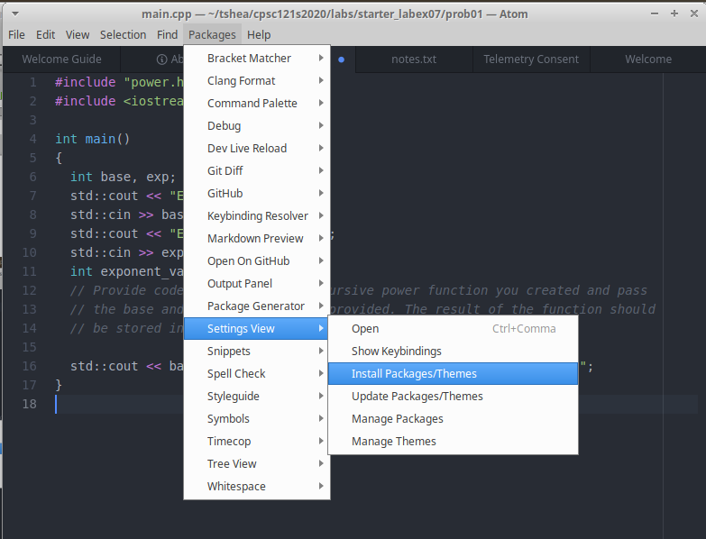
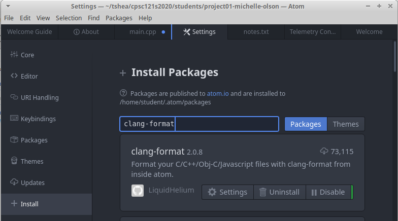
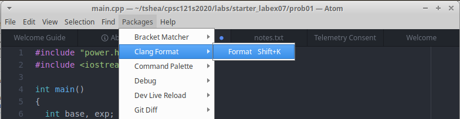

# clang-format

# Installation
1. Close all open Atom windows.
1. Open Atom with the right permissions.
    - If you are using Virtual Box: From a `Terminal` window, type `sudo atom` in order to open `Atom` with administrator permissions. 
   ```
   sudo atom
   ```
    - If you are using a machine in a CSUF lab: From a `Terminal` window, type `atom`.
   ```
   atom
   ```
1. In `Atom` choose `Packages` -> `Settings View` -> `Install Packages/Themes`

   

1. Type `clang-format` in the `Search` window, and select `Install` on the package `clang-format 2.0.8`

   

# Usage

1. In `Atom` choose `Packages` -> `Clang Format` -> `Format`

   This command can also be issued using the shortcut <kbd>Shift</kbd> + <kbd>K</kbd>.
   
   
